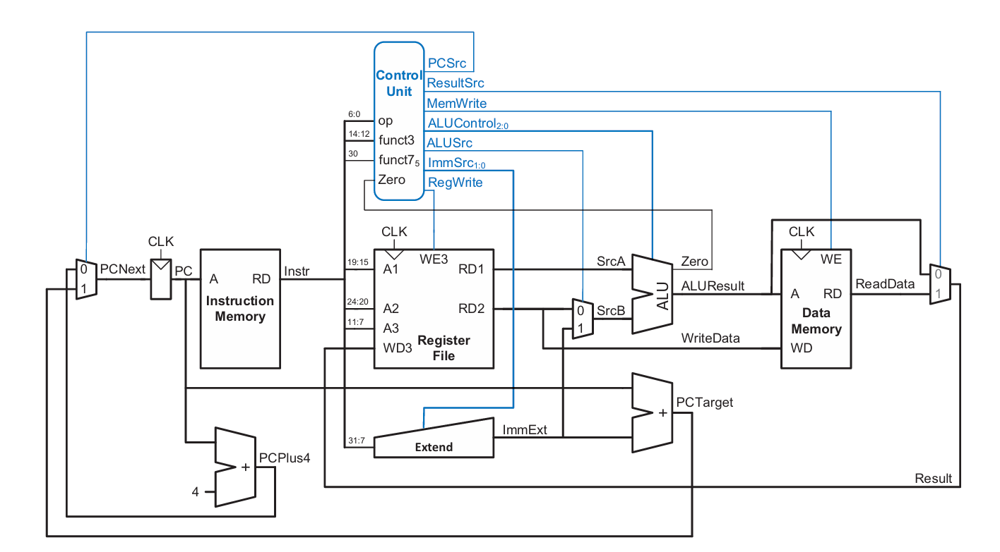

# SPEC-1-RISC-V Basys3 Single-Cycle Core

## Background

This project implements a **single-cycle RV32I** RISC‑V processor on the **Digilent Basys3** board (Xilinx Artix‑7). The design supports all base instruction *formats* (R, I, S, B, U, J) and targets on‑board BRAM for instruction and data memories. A Xilinx **Clocking Wizard (MMCM)** divides the on‑board 100 MHz oscillator to a **70 MHz core clock** for timing closure and power efficiency. The top module wires together the core datapath (PC, Register File, ALU, Immediate Generator, Branch/JALR logic), instruction/data memories, a control unit, and debug/visibility IP (ILA).

* **Clock/Reset**: `clk_raw` (100 MHz) → `clk_wiz_0` → `clk` (70 MHz). Reset is synchronized/debounced via a small wrapper that combines the raw reset and MMCM `locked` signal to produce `rst`.
* **Observability**: ILA probes include `pc_plus4`, `pc_plusImm`, `pc_outputAdrs`, and `data_memory_3` for on‑chip debug.
* **Memory‑mapped I/O / Debug taps**: `datamemory_3[7:0]` and `datamemory_4[6:0]` are **optional output wires** used only to peek at stored data in data memory during bring‑up (e.g., driving LEDs or a logic analyzer). They can be removed without affecting functionality.
* **Control**: Central `control_unit` decodes `opcode`, `funct3`, and `funct7[5]` into `{aluControl, immSrc, resultSrc, branch, memWrite, aluSrc, regWrite, jump, auipcSrc, jalr}`.
* **Datapath highlights**: 32‑bit main ALU; separate adders for `PC+4` and `PC+Imm`; `pcMUX` selects among sequential, branch, JAL, and JALR targets in a single cycle.
* **Status**: Timing closes with positive slack at 70 MHz in Vivado; power dominated by MMCM per tool report.

> Screenshots in the repo (block diagram, clock summary, power, timing) should be placed under `docs/` and referenced from later sections.

**Reference used while building this core**

* *Digital Design and Computer Architecture: RISC‑V Edition* by Sarah L. Harris and David Money Harris.

### Architecture Overview

---

## Artifacts & Screenshots (Repo Paths)

Place these files under the `docs/` folder and the links below will work directly on GitHub:

* **RTL Schematic** → [`docs/RTL_Schematic.png`](docs/RTL_Schematic.png)
* **Clocking Wizard Summary** → [`docs/clock_summary.png`](docs/clock_summary.png)
* **Timing Summary** → [`docs/timing.png`](docs/timing.png)
* **Power Report** → [`docs/power_summary.png`](docs/power_summary.png)
* **Book Cover** → [`docs/book_cover.png`] (docs/book_cover.png)

